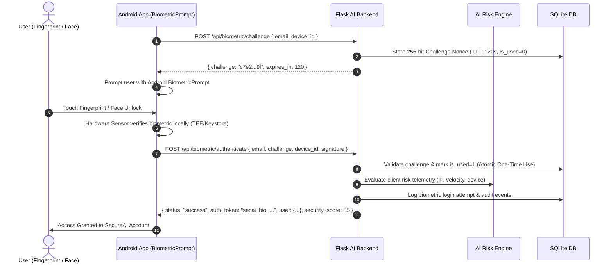

# SecureAI - AI-Powered Password & Account Security Platform

SecureAI is a cybersecurity defense platform combining Machine Learning (Random Forest classification), Shannon Entropy password analysis, behavioral anomaly detection, and **hardware-backed Android Biometric Authentication (BiometricPrompt / WebAuthn)**.

---

## 🔒 Biometric Security Architecture & Privacy Guarantee

> ### 🛡️ Zero Biometric Data Transmission Rule
> **The Flask server NEVER receives, stores, or processes raw fingerprints, facial scans, biometric images, or sensor templates.**
> 
> All biometric verification is executed **locally on the Android hardware** using Android's official `BiometricPrompt` and Android Keystore (Trusted Execution Environment / TEE).
> 
> Authentication with the backend is achieved using a **cryptographic challenge-response token protocol** that prevents replay attacks, MITM tampering, and credential theft.

---

## 🔄 Android Biometric Challenge-Response Flow



---

## 📡 Biometric API Endpoints

### 1. Request One-Time Challenge
- **Endpoint**: `POST /api/biometric/challenge`
- **Request Body**:
  ```json
  {
    "email": "user@example.com",
    "device_id": "android_hardware_uuid_001"
  }
  ```
- **Response (200 OK)**:
  ```json
  {
    "status": "success",
    "challenge": "cc2a33a15c56499173f4e183619280d8502f9c8f2a9712be67d10b751aa945b0",
    "expires_in": 120,
    "user_id": 1,
    "timestamp": "2026-09-05T11:45:00.000Z"
  }
  ```

---

### 2. Enroll Android Device
- **Endpoint**: `POST /api/biometric/register-device`
- **Request Body**:
  ```json
  {
    "email": "user@example.com",
    "password": "AccountPassword123!",
    "device_id": "android_hardware_uuid_001",
    "device_name": "Google Pixel 8 Pro",
    "public_key": "optional_keystore_public_key"
  }
  ```
- **Response (200 OK)**:
  ```json
  {
    "status": "success",
    "message": "Device 'Google Pixel 8 Pro' successfully enrolled with biometric hardware fast-pass.",
    "device": {
      "device_id": "android_hardware_uuid_001",
      "device_name": "Google Pixel 8 Pro",
      "user_email": "user@example.com"
    },
    "security_score": {
      "score": 75,
      "rating": "Good",
      "biometrics_active": true
    }
  }
  ```

---

### 3. Verify Biometric Authentication
- **Endpoint**: `POST /api/biometric/authenticate`
- **Request Body**:
  ```json
  {
    "email": "user@example.com",
    "challenge": "cc2a33a15c56499173f4e183619280d8502f9c8f2a9712be67d10b751aa945b0",
    "device_id": "android_hardware_uuid_001",
    "signature": "optional_ecdsa_keystore_signature",
    "device_info": "Google Pixel 8 Pro (Android 14)"
  }
  ```
- **Response (200 OK)**:
  ```json
  {
    "status": "success",
    "message": "Biometric authentication verified for Alex Mercer.",
    "auth_token": "secai_bio_7cdec8df21a3f1761f9ce2e8758e82f05fa256eb",
    "user": {
      "id": 1,
      "name": "Alex Mercer",
      "email": "user@example.com",
      "role": "User"
    },
    "security_score": {
      "score": 85,
      "rating": "Excellent",
      "biometrics_active": true
    },
    "redirect_url": "/dashboard"
  }
  ```

---

### 4. Error Responses
| Error Code | HTTP Status | Meaning |
| :--- | :--- | :--- |
| `EXPIRED_CHALLENGE` | 401 | Challenge exceeded its 120-second TTL. Request a new challenge. |
| `REPLAY_DETECTED_ALREADY_USED` | 401 | Challenge nonce was already consumed. Replay attack blocked. |
| `INVALID_CHALLENGE` | 400 | Challenge does not exist in the database. |
| `USER_NOT_FOUND` | 404 | Target user account does not exist. |
| `INVALID_CREDENTIALS` | 401 | Password check failed during device enrollment. |
| `DEVICE_USER_MISMATCH` | 403 | Device is registered to a different account. |

---

## 📱 Android Studio Integration Example (Kotlin)

### 1. Trigger Local Biometric Verification:
```kotlin
import androidx.biometric.BiometricPrompt
import androidx.core.content.ContextCompat

fun authenticateWithBiometrics(activity: AppCompatActivity, challenge: String, email: String) {
    val executor = ContextCompat.getMainExecutor(activity)
    
    val promptInfo = BiometricPrompt.PromptInfo.Builder()
        .setTitle("SecureAI Biometric Fast-Pass")
        .setSubtitle("Confirm your fingerprint or face to sign in")
        .setNegativeButtonText("Use Password")
        .build()

    val biometricPrompt = BiometricPrompt(activity, executor,
        object : BiometricPrompt.AuthenticationCallback() {
            override fun onAuthenticationSucceeded(result: BiometricPrompt.AuthenticationResult) {
                super.onAuthenticationSucceeded(result)
                // Biometric verified locally by Android OS -> Send challenge to Flask
                sendAuthToFlask(email, challenge)
            }

            override fun onAuthenticationError(errorCode: Int, errString: CharSequence) {
                super.onAuthenticationError(errorCode, errString)
                Toast.makeText(activity, "Biometric error: $errString", Toast.LENGTH_SHORT).show()
            }
        })

    biometricPrompt.authenticate(promptInfo)
}
```

---
    

## 🧪 Testing Backend Biometric Endpoints

Run the automated test suite in PowerShell:
```powershell
.venv\Scripts\python.exe scratch\test_biometric_android.py
.venv\Scripts\python.exe scratch\test_pipeline.py
```
